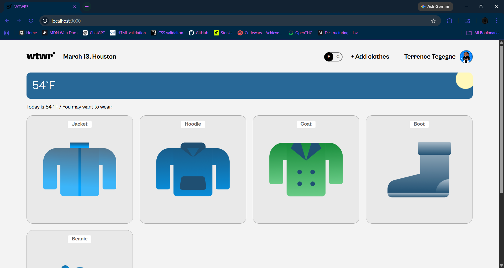
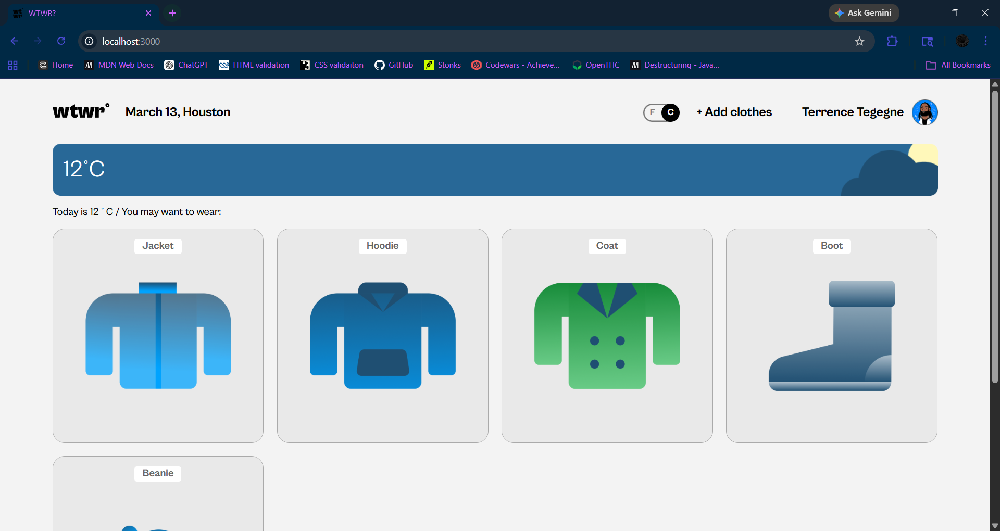
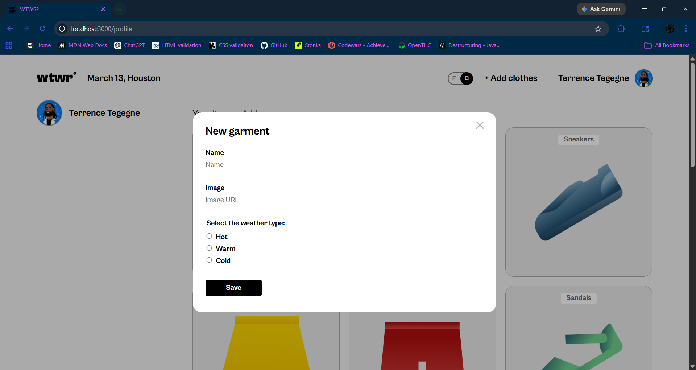
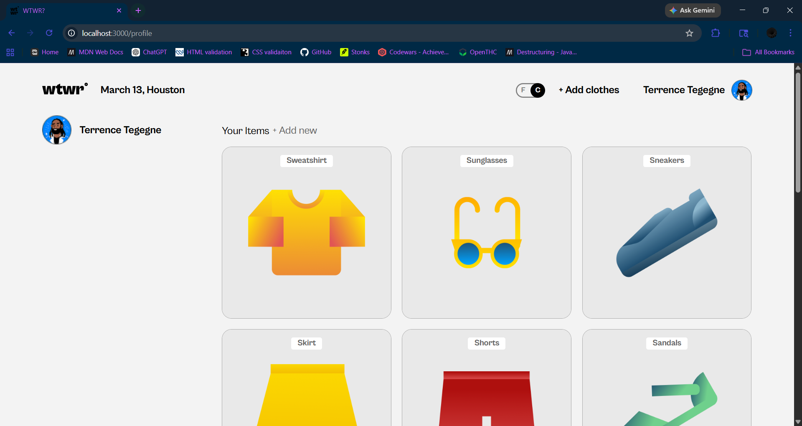

# WTWR(What to Wear?) via React + Vite

This project is a React-based weather application that uses the OpenWeather API to fetch real-time weather data such as temperature and current conditions. The app allows users to switch between Fahrenheit and Celsius using a toggle located in the header, updating the UI dynamically based on the selected unit.

Users can add clothing items by submitting a garment name, image URL, and weather type, allowing the app to organize wardrobe choices around specific weather conditions. Each item is rendered through reusable React components and stored in application state to support interactive updates.

The application also includes a User Profile route implemented with React Router, where users can view a list of previously added garments and delete items as needed.

# Tech Stack:

<ins>Frontend:</ins>

\-React (Functional Components + Hooks)
\-JavaScript (ES6+)
\-HTML5
\-CSS3 (Responsive Layout / Flexbox)
\-Routing
\-React Router for client-side navigation and profile page routing

<ins>API Integration:</ins>

\-OpenWeather API for fetching real-time weather data (temperature and conditions)
\-Asynchronous data handling using Promises and fetch

<ins>State Management:</ins>

\-React Hooks (useState, useEffect) for managing weather data, clothing items, and UI state

<ins>Forms & Validation:</ins>

\-Controlled components for managing user input
\-Dynamic form submission for adding clothing items
\-Development Tools
\-Vite / Webpack (depending on what your WTWR uses)
\-Git & GitHub for version control
\-GitHub Pages for deployment

# ScreenShots:

# Project Pitch Video

<a href="https://www.loom.com/share/aab1fec5d17f4d17b4fedf92c67d51c6">Check out my Pitch Video.</a>

# Local Deploy:

Paste the following into Terminal:

1. "npm install -g json-server@^0"
2. "json-server --watch db.json --id \_id --port 3001"
3. "npm run dev"
